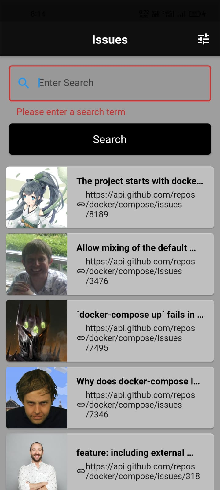
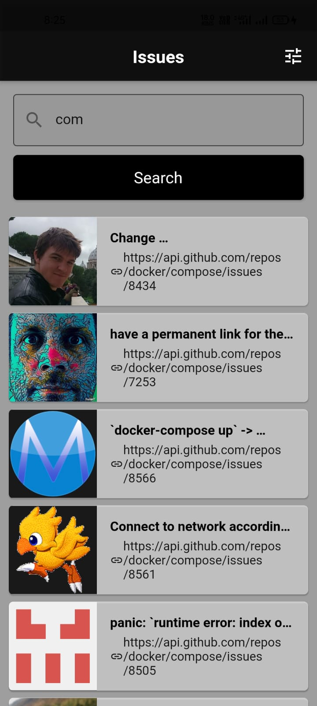
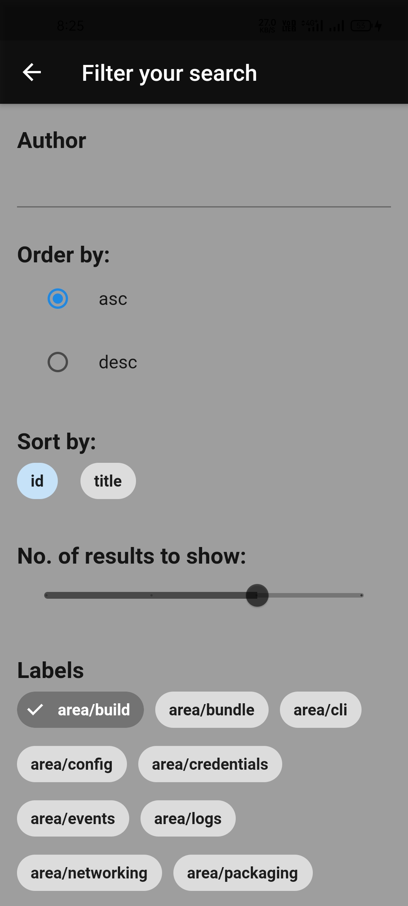

# Github issues mobile
</img>
</img>
</img>
</img>


## About the Project
This is a hiring assignment for Flutter developer. For demo purpose I have chosen docker compose repo to show its issues search and other filter features. I have used older version of github API which doesn't requires authentication and access token. This same can be acheived using v3 Github API. In the below steps of getting started, you can skip the github access token step.
Also to note that Github API response are paginated, which means that to get more results we have to constantly increase last part of the endpoint to hit. For demo purpose, I haven't implemented the paginated version but can be done with some additions to the code.

<!-- GETTING STARTED -->
## Getting Started

To get a local copy up and running follow these simple steps.

### Prerequisites

* [Install](https://flutter.dev/docs/get-started/install/) Flutter
* Get Github API access token if required. Follow the guide [here](https://docs.github.com/en/github/authenticating-to-github/keeping-your-account-and-data-secure/creating-a-personal-access-token)


### Installation

1. Clone the repo
   ```sh
   git clone https://github.com/abhishekaashu/issue_finder.git
   ```
2. Install FLUTTER 2.0.5 (SDK Version)
   ```sh
   Install DART 2.12.3
   ```

## Adding a package dependency to an app

1.Depend on it
   ```sh
   Open the pubspec.yaml file located inside the app folder.
   ```
2.Install it
  ```sh
  a.From the terminal: Run flutter pub get.
  OR
  b.From Android Studio/IntelliJ: Click Packages get in the action ribbon at the top of pubspec.yaml.
  c.From VS Code: Click Get Packages located in right side of the action ribbon at the top of pubspec.yaml.
  ```

<!-- USAGE EXAMPLES -->
## Usage

1. Set the environment variables.

2. Start the server
   ```sh
   flutter run
   ```
   
   
